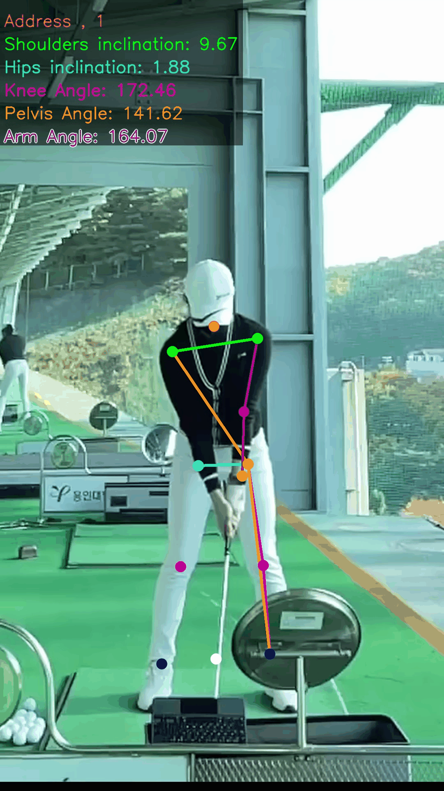
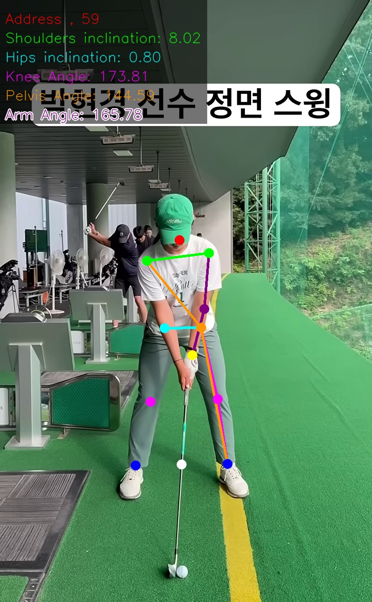
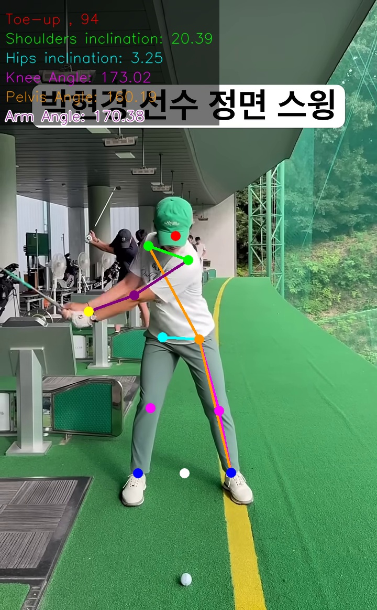
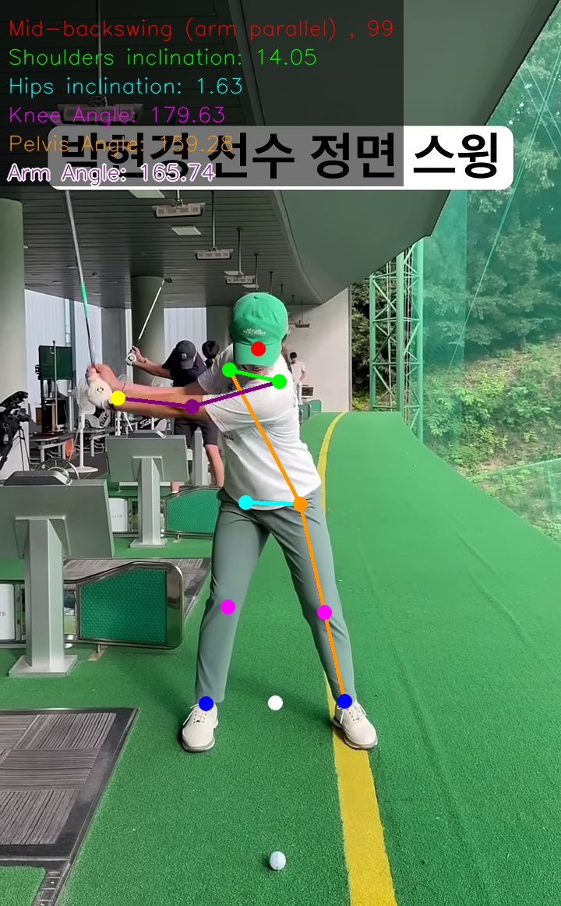
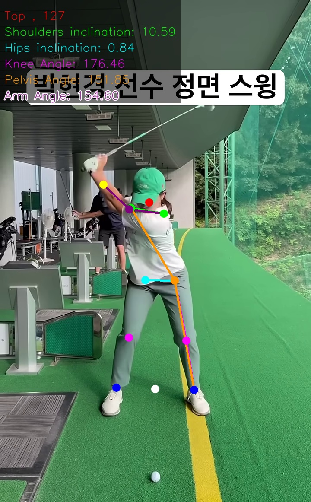
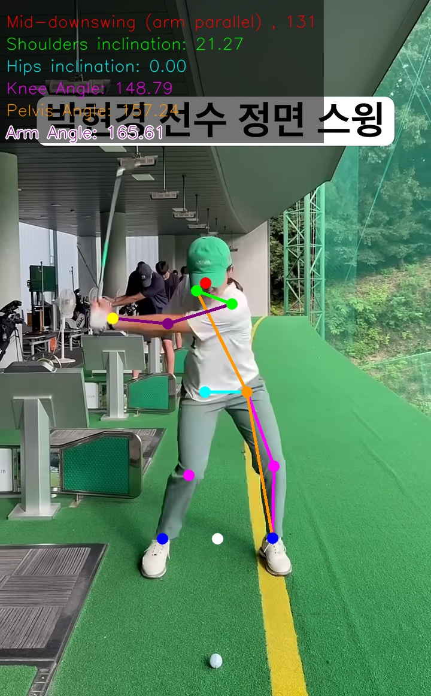
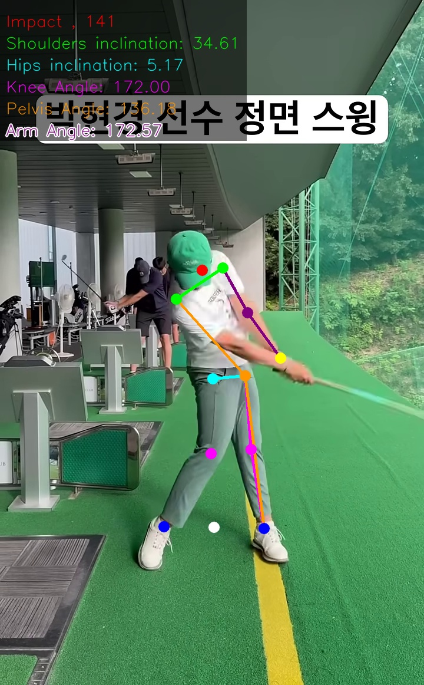
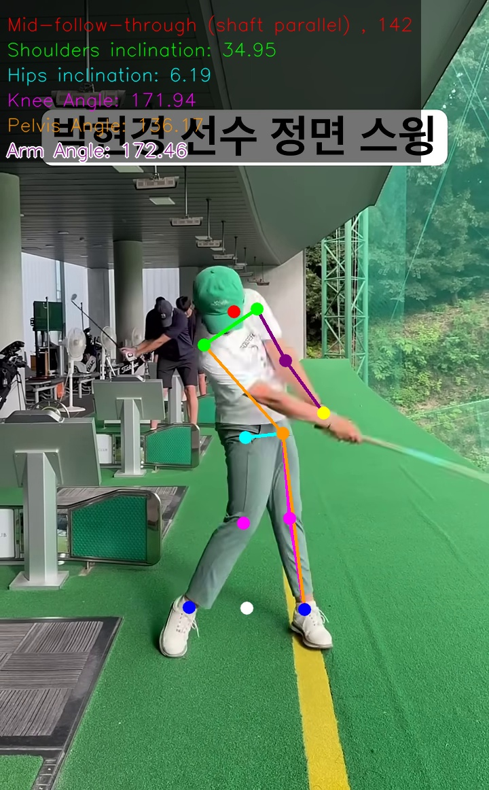
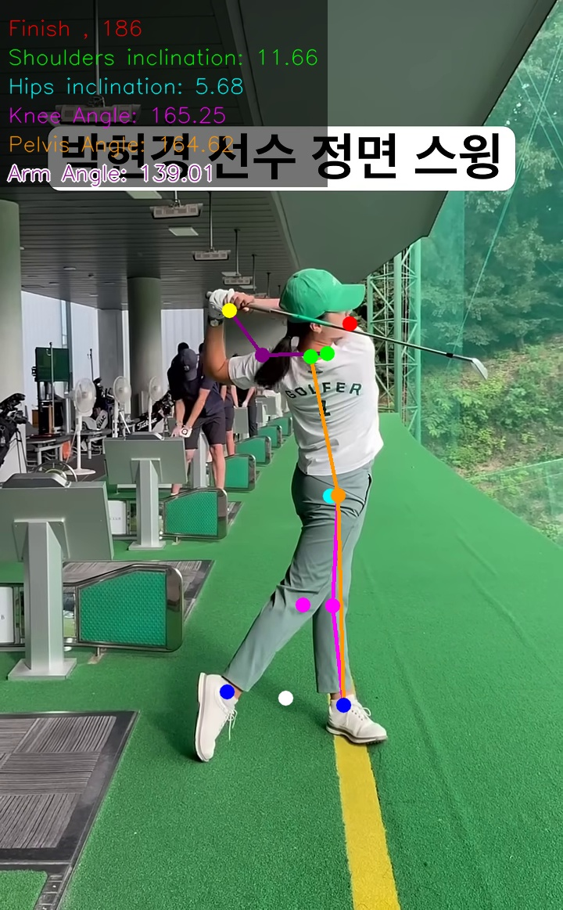

# 🏌️ SwingNetV2 — 골프 스윙 이벤트 탐지 시스템

> [McNally et al. GolfDB](https://github.com/wmcnally/golfdb) 기반의 경량 하이브리드 딥러닝 모델 **SwingNet**을 개선한 골프 스윙 분석 프로젝트입니다.  
> 스윙의 8개 핵심 이벤트를 자동 탐지하고, MediaPipe HPE를 통한 자세 분석 지표를 함께 제공합니다.

<p align="center">
  
</p>

---

## 📋 목차

- [개요](#-개요)
- [탐지 이벤트](#-탐지-이벤트)
- [모델 비교](#-모델-비교)
- [주요 개선 사항](#-주요-개선-사항)
- [HPE 분석 지표](#-hpe-분석-지표)
- [결과](#-결과)
- [설치 및 실행](#-설치-및-실행)
- [디렉토리 구조](#-디렉토리-구조)

---

## 🧩 개요

기존 SwingNet의 구조에 최신 딥러닝 기법을 통합하여 **정확도**, **일반화 성능**, **학습 안정성**을 향상시켰습니다.  
**데이터 불균형** 및 **자원 제약 환경**에서의 문제를 해결하고, HPE 기반 코칭 지표로 실용성을 높였습니다.

---

## 🎯 탐지 이벤트

골프 스윙을 8개의 핵심 동작 단계로 분류합니다.

| Index | 이벤트 | 설명 |
|:---:|---|---|
| 0 | **Address** | 어드레스: 스윙 준비 자세 |
| 1 | **Toe-up** | 토업: 백스윙 초반, 클럽 헤드가 지면과 수평 |
| 2 | **Mid-backswing** | 미드 백스윙: 팔이 지면과 평행한 지점 |
| 3 | **Top** | 탑: 백스윙 최고점 |
| 4 | **Mid-downswing** | 미드 다운스윙: 팔이 다시 지면과 평행한 지점 |
| 5 | **Impact** | 임팩트: 클럽이 볼을 맞추는 순간 |
| 6 | **Mid-follow-through** | 미드 팔로우스루: 샤프트가 지면과 평행한 지점 |
| 7 | **Finish** | 피니시: 스윙 종료 자세 |

---

## 🏗️ 백본 선정

골프 스윙 이벤트 탐지를 위해 **ConvLSTM**, **MobileNetV2**, **MobileNetV4**, **EfficientNet V2 Large** 등 여러 모델을 실험·비교한 프로젝트입니다.  
최종적으로 ConvLSTM 기반 모델이 가장 우수한 성능을 보였습니다.

---

## ✨ 주요 개선 사항

### 학습 안정성
| 기법 | 세부 내용 |
|---|---|
| **Warm-up LR** | 3 에폭 동안 학습률을 0.0001 → 0.001로 선형 증가 |
| **Cosine Annealing Warm Restarts** | T_0=10, T_mult=2, η_min=1e-6 |
| **Mixed Precision (AMP)** | FP16 학습으로 속도 및 메모리 효율 향상 |
| **Early Stopping** | patience=7, δ=1e-4 |

### 데이터 편향 완화
| 기법 | 세부 내용 |
|---|---|
| **클래스 가중치 CrossEntropy** | 이벤트 클래스(1/8) vs 배경 클래스(1/35) 불균형 보정 |
| **Flip / Rotate 증강** | 과적합 방지 및 다양한 스윙 패턴 학습 |

### 자원 효율
| 기법 | 세부 내용 |
|---|---|
| **Gradient Accumulation** | 제한된 GPU 메모리에서 큰 배치 효과 |
| **Gradient Clipping** | 그래디언트 폭발 방지 |
| **AdamW** | weight_decay=0.01, 일반화 성능 향상 |

### 성능 지표
- Accuracy, Precision (macro), Recall (macro), **F1-Score (macro)**
- TensorBoard 실시간 모니터링

---

## 📐 HPE 분석 지표

MediaPipe PoseLandmarker를 통해 각 이벤트 프레임에서 아래 5가지 자세 지표를 자동 계산합니다.

| 지표 | 측정 관절 | 의미 |
|---|---|---|
| **Knee Angle** | 엉덩이 → 무릎 → 발목 | 무릎 굽힘 정도 |
| **Pelvis Angle** | 발목 → 엉덩이 → 반대쪽 어깨 | 골반 회전 각도 |
| **Arm Angle** | 손목 → 팔꿈치 → 어깨 | 팔 굽힘 각도 |
| **Shoulders Inclination** | 왼쪽 어깨 ↔ 오른쪽 어깨 | 어깨 기울기 |
| **Hips Inclination** | 왼쪽 엉덩이 ↔ 오른쪽 엉덩이 | 골반 기울기 |

결과 이미지에 랜드마크와 수치가 함께 오버레이되어 저장됩니다 (`output/output{frame}.jpg`).

---

## 📊 결과

> 아래 이미지는 `predict.py` 실행 후 `output/` 폴더에 저장된 결과입니다.

### 스윙 시퀀스 (Address → Finish)

동일 영상에서 탐지된 8개 이벤트 프레임에 HPE 오버레이를 적용한 결과입니다.  
각 프레임에는 이벤트명, 프레임 번호, 5가지 자세 각도가 함께 표시됩니다.

| Address | Toe-up | Mid-backswing | Top |
|:---:|:---:|:---:|:---:|
|  |  |  |  |

| Mid-downswing | Impact | Mid-follow-through | Finish |
|:---:|:---:|:---:|:---:|
|  |  |  |  |

<sub>※ 테스트 영상은 모델 출력결과 확인 목적으로만 사용되었으며, 영상의 저작권은 원저작자에게 있습니다.</sub>

---

## 🚀 설치 및 실행

### 요구 사항

```
Python >= 3.8
PyTorch >= 2.0 (CUDA 지원 권장)
mediapipe
opencv-python
scikit-learn
tensorboard
```

### 설치

```bash
pip install torch torchvision
pip install mediapipe opencv-python scikit-learn tensorboard
```

### 1단계: 데이터 준비

```bash
# golfdb.mat → train_split.pkl / val_split.pkl 생성
python data/generate_splits.py
```

전처리된 160×160 비디오 클립을 다운로드하여 `data/videos_160/` 에 위치시키세요.  
직접 영상을 수집하는 경우:

```bash
# YouTube 영상 다운로드
python data/youtube_download.py

# 영상 전처리
python data/preprocess_videos.py
```

### 2단계: 학습

```bash
python train.py
```

학습 로그는 TensorBoard로 확인할 수 있습니다:

```bash
tensorboard --logdir runs/
```

### 3단계: 예측

사전 학습된 가중치(`best_conv_lr.pth`)를 `models/` 폴더에 넣은 후:

```bash
python predict.py -p your_video.mp4 -s 64
```

결과 이미지가 `output/` 폴더에 저장됩니다.

---

## 📁 디렉토리 구조

```
SwingNetV2/
├── data/
│   ├── golfDB.mat              # 원본 데이터셋
│   ├── train_split.pkl         # 학습 분할
│   ├── val_split.pkl           # 검증 분할
│   ├── generate_splits.py      # 데이터 분할 스크립트
│   ├── preprocess_videos.py    # 영상 전처리
│   └── youtube_download.py     # YouTube 수집
├── model/
│   ├── MobileNetV2.py
│   ├── MobileNetV4.py
│   └── EfficientNet V2 Large.py
├── models/
│   └── best_conv_lr.pth        # 학습된 가중치 (별도 다운로드)
├── output/                     # 예측 결과 이미지
├── runs/                       # TensorBoard 로그
├── model.py                    # 메인 모델 (ConvLSTM-based)
├── dataloader.py               # 데이터 로더
├── train.py                    # 학습 스크립트
├── predict.py                  # 예측 + HPE 시각화
├── predict_utils.py            # 유틸리티 함수 및 이벤트 이름
└── util.py                     # 공통 유틸리티
```

---

## 🔗 참고

- [GolfDB](https://github.com/wmcnally/golfdb) — McNally et al., CVPR 2019
- [MediaPipe Pose](https://developers.google.com/mediapipe/solutions/vision/pose_landmarker) — Google
